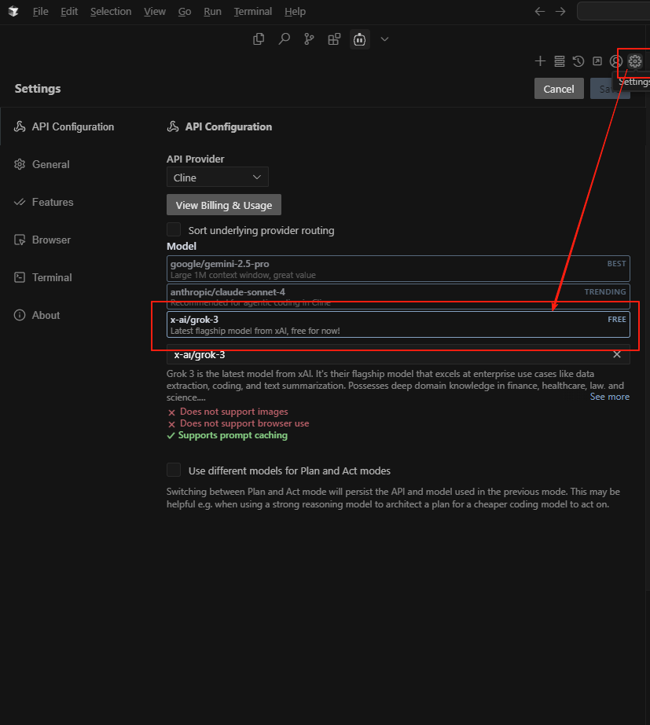
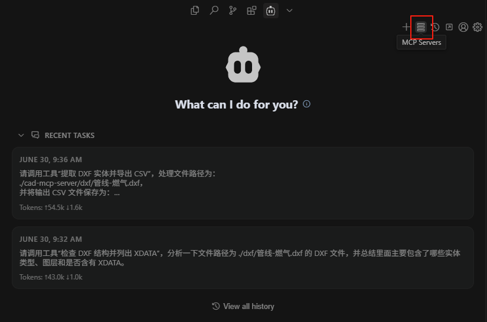
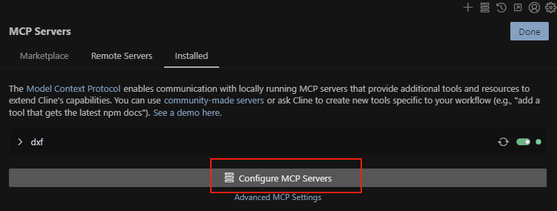
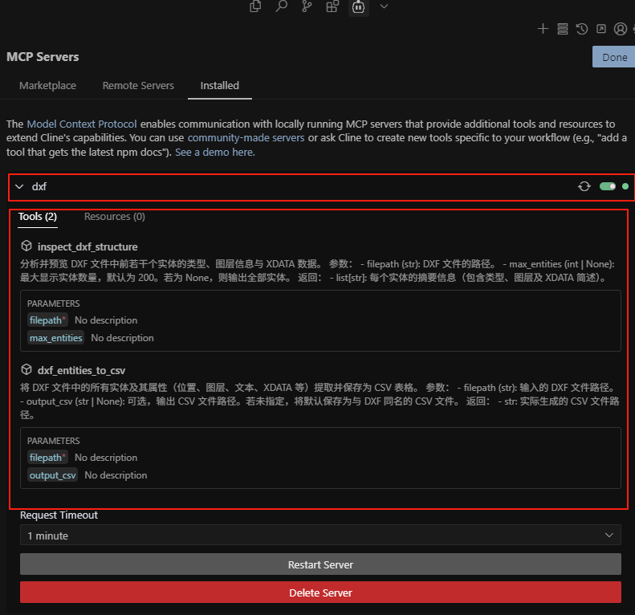

# DXF MCP 工具完整指南

提供两种部署方式：**本地版**（stdio）和**远程版**（HTTP + SSE），满足不同场景需求。

## 🏗️ 架构对比

| 特性           | 本地版 (stdio)         | 远程版 (Docker + HTTP + SSE) |
| -------------- | ---------------------- | ---------------------------- |
| **部署位置**   | 本地电脑               | 云服务器 (Docker 容器)       |
| **通信方式**   | stdio 标准输入输出     | HTTP API + SSE               |
| **文件管理**   | 直接访问本地文件系统   | 上传/下载机制                |
| **部署复杂度** | 简单                   | 中等（Docker 一键部署）      |
| **扩展性**     | 单机限制               | 容器化，易于扩展             |
| **适用场景**   | 单机开发、本地文件处理 | 多人协作、云端处理           |
| **网络要求**   | 无                     | 需要稳定网络连接             |

------

## 📦 本地版 MCP 服务

### 🔧 工具环境

- 使用开发工具：`Cursor` + `cline`
- 使用包管理器：`uv`
- 核心依赖：`ezdxf`, `tqdm`, `mcp[cli]`

### 🚀 创建工程

```bash
uv init my-mcp-server
cd my-mcp-server
uv add ezdxf "mcp[cli]"
```

### 🧠 MCP 主程序封装

创建文件 `dxf_server.py`，实现两个 MCP 工具：

```python
"""
dxf_server.py
暴露两个 MCP 工具：
1. inspect_dxf_structure  —— 预览 DXF 结构与 XDATA
2. dxf_entities_to_csv    —— 提取实体+XDATA 并导出为 CSV
"""

from pathlib import Path
import csv
import ezdxf
from ezdxf.layouts import Modelspace
from tqdm import tqdm
from mcp.server.fastmcp import FastMCP

# 创建 MCP 实例
mcp = FastMCP("CAD-DXF 工具服务", dependencies=["ezdxf", "tqdm"])

# 工具 1：检查 DXF 结构
@mcp.tool(title="检查 DXF 结构并列出 XDATA")
def inspect_dxf_structure(filepath: str, max_entities: int | None = 200) -> list[str]:
    ...
    # 实现见上文，提取类型、图层、XDATA

# 工具 2：DXF → CSV
@mcp.tool(title="提取 DXF 实体并导出 CSV")
def dxf_entities_to_csv(filepath: str, output_csv: str | None = None) -> str:
    ...
    # 实现见上文，提取实体属性、坐标、文本、XDATA，并写入 CSV

if __name__ == "__main__":
    mcp.run(transport="stdio")
```

### 📁 工程目录结构

```
my-mcp-server/
├── dxf_server.py        # MCP 主服务入口
├── pyproject.toml       # uv 项目配置
└── cad-mcp-server/
    └── dxf/
        ├── 管线-燃气.dxf
        └── 管线-燃气.csv
```

### ⚙️ 本地版 MCP Server 配置（`mcp.config.json`）

选择合适的model



打开 mcp server






```json
{
  "mcpServers": {
    "dxf": {
      "disabled": false,
      "timeout": 60,
      "type": "stdio",
      "command": "uv",
      "args": [
        "--directory",
        "D:\\14_MCP\\my-mcp-server",
        "run",
        "dxf-server.py"
      ]
    }
  }
}
```

创建成功后



### ✅ 本地版测试流程

💬 指令输入（Cline Prompt）

```prompt
请调用工具"提取 DXF 实体并导出 CSV"，处理文件路径为：
./cad-mcp-server/dxf/管线-燃气.dxf，
并将输出 CSV 文件保存为：
./cad-mcp-server/dxf/管线-燃气.csv。
```

输出：

````
The tool execution failed again with the same error message indicating that the input file does not exist at 'cad-mcp-server\dxf\管线-燃气.dxf'. Despite trying backslashes, the issue persists. I need to consider if the path is incorrect or if there's another way to specify it.

Looking at the environment details, the file is listed under 'cad-mcp-server/dxf/管线-燃气.dxf' in the current working directory 'd:/14_MCP'. I should try using the full absolute path to ensure there is no ambiguity with relative paths. The full path would be 'd:/14_MCP/cad-mcp-server/dxf/管线-燃气.dxf'. I will also use forward slashes as they are generally accepted in Windows for programmatic paths and might resolve any parsing issues.

I will attempt the tool execution again with the absolute path to see if that resolves the issue.

Cline wants to use a tool on the `dxf` MCP server:

dxf_entities_to_csv

将 DXF 文件中的所有实体及其属性（位置、图层、文本、XDATA 等）提取并保存为 CSV 表格。 参数： - filepath (str): 输入的 DXF 文件路径。 - output_csv (str | None): 可选，输出 CSV 文件路径。若未指定，将默认保存为与 DXF 同名的 CSV 文件。 返回： - str: 实际生成的 CSV 文件路径，或错误信息。

Arguments

```json
{
  "filepath": "d:/14_MCP/cad-mcp-server/dxf/管线-燃气.dxf",
  "output_csv": "d:/14_MCP/cad-mcp-server/dxf/管线-燃气.csv"
}
```

Response

Rich Display

[成功] CSV 文件已生成：D:\14_MCP\cad-mcp-server\dxf\管线-燃气.csv

**Checkpoint

Compare

Restore

API Request$0.0000

I have confirmed from the user's response that the tool execution was successful, and the CSV file has been generated at 'D:\14_MCP\cad-mcp-server\dxf\管线-燃气.csv'. Since the task of extracting DXF entities and exporting them to a CSV file is complete, I can now present the result to the user using the attempt_completion tool.

Task Completed

I've successfully extracted the entities from the DXF file '管线-燃气.dxf' and exported them to the CSV file located at 'D:\14_MCP\cad-mcp-server\dxf\管线-燃气.csv'. The task is complete, and the CSV file contains all the entity attributes as requested.
````

------

## 🌐 远程版 MCP 服务

### 🏗️ 架构特点

- **FastAPI + FastMCP** 集成架构
- **Docker 容器化部署** 🐳 （生产级方案）
- **文件上传/下载** 机制
- **SSE (Server-Sent Events)** 通信
- **云端部署** 支持多客户端访问
- **Gunicorn + Nginx** 生产级配置

### 🛠️ 环境准备

#### Docker 环境（推荐）

```bash
# 确保已安装 Docker 和 Docker Compose
docker --version
docker-compose --version

# 克隆项目（或准备文件）
# 项目已包含完整的 Docker 配置
```

#### 传统环境

```bash
# 安装依赖
pip install fastapi uvicorn ezdxf tqdm fastmcp requests

# 或使用 uv
uv add fastapi uvicorn ezdxf tqdm fastmcp requests
```

### 📝 核心代码结构

```python
"""
remote-dxf-server.py
集成版 DXF 处理服务器：FastAPI + MCP
支持文件上传、下载和 MCP 工具调用
"""

from fastapi import FastAPI, UploadFile, File
from fastmcp import FastMCP
import uvicorn

# 创建 FastAPI 应用和 MCP 服务器
mcp = FastMCP("CAD-DXF 工具服务")
app = FastAPI()

# 文件管理器
class FileManager:
    def __init__(self):
        self.upload_dir = Path("./uploads")
        self.result_dir = Path("./results")
        self.files = {}  # 存储文件信息

# MCP 工具
@mcp.tool(name="获取服务信息和使用指南")
def get_service_info() -> dict:
    """获取服务状态和完整使用流程"""
    
@mcp.tool(name="检查已上传 DXF 文件的结构")
def inspect_uploaded_dxf(file_id: str, max_entities: int = 200) -> list[str]:
    """分析已上传的 DXF 文件结构"""
    
@mcp.tool(name="处理DXF文件并生成CSV")
def process_uploaded_dxf(file_id: str) -> dict:
    """处理 DXF 文件并生成 CSV"""

# FastAPI 端点
@app.post("/upload")
async def upload_dxf_file(file: UploadFile = File(...)):
    """上传 DXF 文件"""

@app.get("/download/{file_id}")
async def download_result_file(file_id: str):
    """下载处理结果"""

# 集成 MCP 服务到 FastAPI
app.mount("/mcp-server", mcp.sse_app())
```

### 🚀 部署方式

#### Docker 容器化部署（推荐）

```bash
# 使用 Docker Compose 一键部署
./deploy.sh build
./deploy.sh start

# 查看服务状态
./deploy.sh status
```

#### 项目结构

```
remote/
├── data/                    # 数据持久化目录
├── deploy.sh               # 部署脚本
├── docker-compose.yml      # Docker Compose 配置
├── Dockerfile             # Docker 镜像构建
├── gunicorn.conf.py       # Gunicorn 生产配置
├── remote-dxf-server.py   # 主服务程序
└── requirements.txt       # Python 依赖
```

#### 传统部署（开发测试）

```bash
# 本地测试
python remote-dxf-server.py

# 使用 gunicorn (生产环境)
gunicorn -w 4 -k uvicorn.workers.UvicornWorker remote-dxf-server:app --bind 0.0.0.0:8000
```

### ⚙️ Cline 配置

```json
{
  "mcpServers": {
    "dxf-processor": {
      "url": "http://your-server.com:8000/mcp-server/sse",
      "transport": "sse"
    }
  }
}
```

### 📋 远程版使用流程

#### 使用 MCP 工具处理

💬 **Cline 指令：**

```prompt
请先查询远程MCP状态，然后调用工具“提取 DXF 实体并导出 CSV”,处理本地文件“管线-燃气.dxf”，最后保存到本地“管线-燃气.csv”
```

输出：

````
请先查询远程MCP状态，然后调用工具“提取 DXF 实体并导出 CSV”,处理本地文件“管线-燃气.dxf”，最后保存到本地“管线-燃气.csv”

See less

Tokens:

**62.5k**443

Cache:

**16.4k

**

**26.6 kB

22.0k

128.0k

Response

Rich Display

{ "service": "DXF 处理服务", "version": "1.0.0", "server_info": { "public_ip": "101.132.89.101", "port": "8000", "public_address": "

http://101.132.89.101:8000

101.132.89.101

101.132.89.101

https://101.132.89.101:8000/

", "status": "运行中" }, "endpoints": { "服务状态": "GET

http://101.132.89.101:8000/

101.132.89.101

101.132.89.101

https://101.132.89.101:8000/

\- 服务状态检查", "上传文件": "POST

http://101.132.89.101:8000/upload

101.132.89.101

101.132.89.101

https://101.132.89.101:8000/upload

\- 上传 DXF 文件", "下载结果": "GET

http://101.132.89.101:8000/download/{file_id}

101.132.89.101

101.132.89.101

https://101.132.89.101:8000/download/%7Bfile_id%7D

\- 下载处理结果", "文件信息": "GET

http://101.132.89.101:8000/files/{file_id}

101.132.89.101

101.132.89.101

https://101.132.89.101:8000/files/%7Bfile_id%7D

\- 获取文件信息", "MCP服务": "

http://101.132.89.101:8000/mcp-server/sse

101.132.89.101

101.132.89.101

https://101.132.89.101:8000/mcp-server/sse

\- MCP 工具端点" }, "access_urls": { "公网访问": "

http://101.132.89.101:8000

101.132.89.101

101.132.89.101

https://101.132.89.101:8000/

", "MCP连接": "

http://101.132.89.101:8000/mcp-server/sse

101.132.89.101

101.132.89.101

https://101.132.89.101:8000/mcp-server/sse

" }, "workflow": [ "1. 上传 DXF 文件: curl.exe -X POST -F 'file=@your_file.dxf'

http://101.132.89.101:8000/upload

101.132.89.101

101.132.89.101

https://101.132.89.101:8000/upload

", "2. 获取返回的 file_id", "3. 使用 MCP 工具处理文件", "4. 下载结果: curl.exe

http://101.132.89.101:8000/download/{file_id}

101.132.89.101

101.132.89.101

https://101.132.89.101:8000/download/%7Bfile_id%7D

\--output xxx" ], "mcp_tools": [ "inspect_uploaded_dxf - 分析 DXF 结构", "process_uploaded_dxf - 转换为 CSV", "get_service_info - 获取服务信息" ], "cline_config": { "mcpServers": { "dxf-processor": { "url": "

http://101.132.89.101:8000/mcp-server/sse

101.132.89.101

101.132.89.101

https://101.132.89.101:8000/mcp-server/sse

", "transport": "sse" } } } }

**Checkpoint

Compare

Restore

API Request$0.0000

Cline wants to execute this command:

```shell
curl.exe -X POST -F "file=@管线-燃气.dxf" http://101.132.89.101:8000/upload
```

Command Output

**Shell Integration Unavailable

Cline may have trouble viewing the command's output. Please update VSCode (`CMD/CTRL + Shift + P` → "Update") and make sure you're using a supported shell: zsh, bash, fish, or PowerShell (`CMD/CTRL + Shift + P` → "Terminal: Select Default Profile"). [Still having trouble?](https://github.com/cline/cline/wiki/Troubleshooting-%E2%80%90-Shell-Integration-Unavailable)

**Checkpoint

Compare

Restore

API Request$0.0000

Cline wants to use a tool on the `dxf-processor` MCP server:

处理已上传 DXF 文件并生成 CSV

处理已上传的 DXF 文件并生成 CSV（位置、图层、文本、XDATA 等）。 重要：如果您是第一次使用此服务，请先调用 'get_service_info' 工具获取完整的使用说明和工作流程。 使用前提条件： 1. 必须先上传 DXF 文件获取 file_id，file_id不是用户给的本地文件的文件名，是在上传服务器后才能得到的。 2. 上传命令示例：curl.exe -X POST -F "file=@your_file.dxf" http://服务器地址/upload 如果您没有 file_id，请： - 调用 'get_service_info' 获取上传方法 - 上传文件后再使用此工具 参数： - file_id (str): 上传文件后获得的唯一标识符 返回： - dict: 处理结果，包含状态、文件信息和下载链接

Arguments

```json
{
  "file_id": "6f0d5b35-e657-4b0a-be0a-7dc94bde5196"
}
```

Response

Rich Display

{ "status": "converted", "file_id": "6f0d5b35-e657-4b0a-be0a-7dc94bde5196", "filename": "管线-燃气.dxf", "entity_count": 3, "csv_rows": 3, "download_url": "/download/6f0d5b35-e657-4b0a-be0a-7dc94bde5196", "message": "转换完成：3 个实体已导出为 CSV", "result_filename": "管线-燃气_result.csv" }

**Checkpoint

Compare

Restore

API Request$0.0000

Cline wants to execute this command:

```shell
curl.exe http://101.132.89.101:8000/download/6f0d5b35-e657-4b0a-be0a-7dc94bde5196 --output 管线-燃气.csv
```

Command Output

**Shell Integration Unavailable

Cline may have trouble viewing the command's output. Please update VSCode (`CMD/CTRL + Shift + P` → "Update") and make sure you're using a supported shell: zsh, bash, fish, or PowerShell (`CMD/CTRL + Shift + P` → "Terminal: Select Default Profile"). [Still having trouble?](https://github.com/cline/cline/wiki/Troubleshooting-%E2%80%90-Shell-Integration-Unavailable)

**Checkpoint

Compare

Restore

API Request$0.0000

Task Completed

成功完成 DXF 文件处理任务。流程如下：

1. 查询了远程 MCP 服务器状态，确认服务运行正常。
2. 上传了本地文件 "管线-燃气.dxf"，获得文件标识符 "6f0d5b35-e657-4b0a-be0a-7dc94bde5196"。
3. 调用工具 "处理已上传 DXF 文件并生成 CSV"，将 DXF 文件转换为 CSV 格式。
4. 下载生成的 CSV 文件，保存为 "管线-燃气.csv"。

CSV 文件已成功保存到本地，可以进行后续分析或其他操作。
````


### 🔧 工具优化特性

#### 智能提示系统

```python
@mcp.tool(name="处理DXF文件并生成CSV")
def process_uploaded_dxf(file_id: str) -> dict:
    """
    🔄 处理已上传的 DXF 文件并生成 CSV
    
    ⚠️  使用前提：必须先上传 DXF 文件获取 file_id
    ❓ 如果您没有 file_id，请先调用 'get_service_info' 获取完整使用流程
    """
```

#### 错误预防机制

```python
if not file_id:
    return {
        "error": "❌ 缺少 file_id 参数", 
        "suggestion": "请先调用 'get_service_info' 获取上传方法",
        "workflow": ["1. 调用 get_service_info", "2. 上传文件", "3. 使用返回的 file_id"]
    }
```

------

## 🔄 完整流程对比

### 本地版流程

```
1. uv init my-mcp-server ➜ 创建工程
2. uv add ezdxf mcp[cli] ➜ 安装依赖
3. 编写 dxf_server.py ➜ 封装 FastMCP 工具
4. 配置 mcp.config.json ➜ 挂载本地工具服务
5. cline prompt ➜ 指令调用 MCP 工具
6. dxf_entities_to_csv ➜ 提取实体写入 CSV
7. 检查输出路径并提示用户成功
```

### 远程版流程（Docker 部署）

```
1. Docker 环境准备 ➜ 安装 Docker & Docker Compose
2. 项目部署 ➜ ./deploy.sh
3. 配置 Cline MCP 连接 ➜ 连接远程服务
4. curl 上传 DXF 文件 ➜ 获取 file_id
5. Cline 调用 get_service_info ➜ 获取使用指南
6. Cline 调用处理工具 ➜ 传入 file_id
7. 容器内处理并生成 CSV ➜ 返回下载链接
8. curl 下载结果文件 ➜ 获取 CSV 文件
```

------

## 📊 使用场景建议

### 选择本地版的情况：

- ✅ 单人开发环境
- ✅ 本地文件处理较多
- ✅ 网络环境不稳定
- ✅ 对数据安全要求高

### 选择远程版的情况：

- ✅ 多人协作项目
- ✅ 需要统一的处理环境
- ✅ 客户端设备性能有限
- ✅ 需要集中管理和监控
- ✅ 要求高可用性和扩展性
- ✅ 偏好容器化部署

------

## 🎯 最佳实践

### 1. 开发阶段

推荐使用**本地版**进行快速开发和调试

### 2. 生产部署

根据团队规模和需求选择：

- 小团队：本地版
- 大团队/企业：远程版

### 3. 混合使用

- 开发：本地版（快速迭代）
- 生产：远程版（稳定服务）